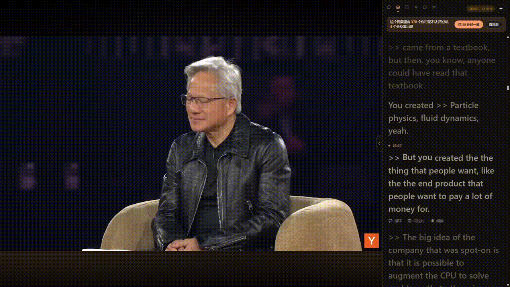

# LingoCue

[](LICENSE)


[](extension)
[](https://jellyfin.org/)

看剧、看 YouTube 学英语的辅助面板。它不负责播放视频，只负责在播放器**旁边**给你一条侧边栏：跟 AI 聊当前剧情、按时间轴翻字幕卡片、悬停查词、循环某句话、记生词。

配合 [Jellyfin](https://jellyfin.org/) 看自己的媒体库，或者装个 Chrome 扩展直接在 youtube.com 官网用。

> **目前仅支持 Windows**

<p align="center">
  
</p>

---

## 目录

- [它能做什么](#它能做什么)
- [装之前需要什么](#装之前需要什么)
- [安装](#安装)
- [三种用法](#三种用法)
- [对话引擎](#对话引擎)
- [配置文件](#配置文件)
- [它是怎么工作的](#它是怎么工作的)
- [已知的坑](#已知的坑)
- [第三方资源](#第三方资源)

---

## 它能做什么

- **字幕卡片** — 整集字幕按时间切成卡片，跟着播放进度自动高亮，点一下跳到那一句
- **循环单句 / 一段** — 点卡片上的循环按钮反复听同一句；再点另一句就变成 A–B 段落循环
- **悬停查词** — 鼠标放到单词上立刻出中文释义（本地词典，不走网络也不花钱），认得出 `went → go` 这类变形
- **发音** — 查词气泡里点喇叭听单词读音，优先用在线词典的真人/高质量语音，网络不通时自动降级成浏览器内置朗读
- **问 AI** — 结合当前播放位置提问，比如「刚才那句 brace yourself 什么意思」。AI 有工具可以自己查当前播放位置和字幕，不需要你复制粘贴
- **生词本** — 查到的词一键存下来，之后可以再让 AI 详细解释
- **中英对照** — 有中文字幕轨的话，可以在每句英文下面显示对应中文
- **深色 / 浅色外观** — 设置页一键切换，跟着喜好来
- **YouTube** — 装个 Chrome 扩展，直接在 youtube.com 官网打开任意视频就有侧边栏，**只下载字幕，不下载视频**（一个视频占几十 KB）

---

## 装之前需要什么

**必须的：**

| 依赖 | 说明 |
|------|------|
| Python 3.10+ | 代码里用了 `X \| None` 这类新语法，3.9 跑不了 |
| [ffmpeg / ffprobe](https://ffmpeg.org/download.html) | 从视频文件里提取内嵌字幕用。装完加进 PATH，或在 `config.json` 里指定目录 |

**按需要的：**

| 依赖 | 什么时候需要 |
|------|-------------|
| [yt-dlp](https://github.com/yt-dlp/yt-dlp) | 用 YouTube 功能时（`pip install yt-dlp`） |
| [Jellyfin](https://jellyfin.org/) | 想看自己媒体库里的片子时 |
| [Claude Code CLI](https://claude.com/claude-code) 或 DeepSeek API key | 对话功能二选一，见下面「对话引擎」 |
| [funasr](https://github.com/modelscope/FunASR)（连 `torch`/`torchaudio`） | 想让完全没标点的 YouTube 自动字幕自动补标点时，见 `requirements.txt` 里的装法说明 |

---

## 安装

```bash
git clone https://github.com/ZBZD-p/lingocue.git
cd lingocue
pip install -r requirements.txt
```

**生成本地词典**（悬停查词用，一次就够）：

```bash
python build_dict.py
```

这会下载 [ECDICT](https://github.com/skywind3000/ECDICT) 的词表并压成一个约 7MB 的 SQLite 文件。原始 CSV 有 63MB / 77 万词，脚本只保留词频前 5 万的部分——剩下的绝大多数是专有名词和生僻词，字幕里根本不会出现。

**启动：**

```bash
python app.py
```

然后打开 <http://127.0.0.1:8420> 就能用了（没有视频时只有对话和生词本可用）。

---

## 三种用法

### 1. 只用面板（最简单）

<http://127.0.0.1:8420> —— 对话、生词本能用，但没有视频进度，所以「刚才那句」这类功能用不了。

### 2. 看 YouTube

装一次 [`extension/`](extension) 这个 Chrome 扩展：`chrome://extensions` 开发者模式 → 「加载已解压的扩展程序」→ 选中 `extension` 文件夹。只需要装这一次，之后一直有效。

后端跟扩展不在同一台机器时，打开扩展的选项页把后端地址改成那台机器的局域网 IP（默认 `http://127.0.0.1:8420`，本机跑就不用改）。

装好之后直接在 `youtube.com` 打开任意视频，侧边栏会自动出现、自动识别当前视频并抓字幕（**不下载视频**）。第一次抓某个视频的字幕要十几秒，期间视频可以先看，字幕好了会自动出现；换到别的视频也会自动重新识别，不用手动操作。

> 改了 [`static/tutor-panel.js`](static/tutor-panel.js) 之后，这个扩展不会自动读到最新版本——它打包的是单独一份 [`extension/tutor-panel.js`](extension/tutor-panel.js)，需要手动 `cp static/tutor-panel.js extension/tutor-panel.js` 重新同步，再去 `chrome://extensions` 点一下刷新。独立页面和 Jellyfin 注入这两种用法不受影响，改完刷新页面就是最新的。

### 3. 注入到 Jellyfin（本地媒体库）

面板会以侧边栏形式出现在 Jellyfin 自己的播放页面旁边。

先在 `jellyfin_config.json` 里填好地址和 API key（复制 `jellyfin_config.example.json` 改），然后**用管理员权限**的 PowerShell 跑：

```powershell
powershell -ExecutionPolicy Bypass -File .\inject.ps1
```

这个脚本会在 Jellyfin 自带的 `index.html` 里加一行 `<script>`，并开一条 8420 端口的防火墙入站规则（仅专用网络，为了手机能访问）。

要撤销：

```powershell
powershell -ExecutionPolicy Bypass -File .\inject.ps1 -Remove
```

> Jellyfin 每次升级都会覆盖 `index.html`，注入会失效，重跑一次即可（脚本会先清掉旧的，重复跑是安全的）。

**手机访问**：跟电脑连同一个 Wi-Fi，浏览器打开 `http://<电脑局域网IP>:8096`（IP 用 `ipconfig` 查）。

---

## 对话引擎

设置页里可以切换，两种各有取舍：

**Claude Code CLI**（默认）— 需要装 [Claude Code](https://claude.com/claude-code) 并登录。质量好，但每次对话有约 13 秒的固定启动开销（进程启动 + 加载，跟生成内容无关）。

**DeepSeek API** — 需要自己申请 [DeepSeek](https://platform.deepseek.com/) 的 key，填在设置页里。直接 HTTP 调用，没有上面那层启动开销，明显更快。

两个引擎用的是同一套工具（查播放状态、查字幕、搜台词），但各自记各自的对话历史，切换不会互相污染。

---

## 配置文件

带 `.example` 后缀的是模板，复制一份去掉 `.example` 再改。**真实的配置文件都在 `.gitignore` 里，不会被提交。**

| 文件 | 干什么的 |
|------|---------|
| `config.json` | 文件路径类配置。`youtube_cache_dir` 是 YouTube 字幕存哪（默认项目下的 `youtube/`），`ffmpeg_dir` 是 ffmpeg 不在 PATH 时的兜底目录 |
| `jellyfin_config.json` | Jellyfin 地址和 API key（在 Jellyfin 控制台 → API 密钥里生成） |
| `deepseek_config.json` | DeepSeek 的 key 和模型。也可以直接在设置页里填，会自动写到这里 |

`mcp_config.json` 不用管，`app.py` 启动时会按本机路径自动生成。

---

## 它是怎么工作的

**播放不归它管。** Jellyfin 负责浏览媒体库和串流，YouTube 就是 youtube.com 官网自己的播放器。这个项目只做旁边那条侧边栏。

**面板跑在播放器所在的页面里**，而不是 iframe 里 —— 这样才能直接读到 `<video>` 元素的播放进度。所有功能（字幕高亮、循环、问 AI）都建立在这个进度之上。YouTube 那边靠 Chrome 扩展把面板注入进官网页面本身，同时监听 YouTube 单页应用内部的换视频事件，换视频不用刷新页面就能识别。

**字幕来源有三层**：优先找视频旁边的外挂字幕文件，其次找之前提取过的缓存，最后才从视频容器里现提。

提取内嵌字幕这一步比想象中慢——字幕数据和视频数据在文件里是交错存放的，ffmpeg 为了拿到那 30KB 字幕得把整个文件读一遍（7.5GB 的 4K 视频实测约 84 秒）。所以 [`mkv_subs.py`](mkv_subs.py) 自己走了一遍 MKV 的 EBML 结构，看到视频块的头就直接跳过去不读那些字节，同样的文件降到约 24 秒，输出逐字节一致。

**提取永远不在请求里做** —— 后台线程边提取边发布，字幕页从头开始逐段填充，同时预取下一集。所以切集时通常已经准备好了。

**AI 不是被灌字幕的。** 它有工具可以自己查当前播放位置、查最近这一段字幕、按时间段查、全集搜关键词。这样每次提问不用为整集字幕付费，它也能自己决定要不要往前翻。

**YouTube 自动字幕完全没标点时**，会在后台用本地的 [FunASR](https://github.com/modelscope/FunASR) `ct-punc` 模型悄悄补一遍标点再重新切句，不阻塞字幕先出来。这是个逐词分类模型，不是生成式改写，所以不会漏词/加词/改写内容——失败了就原样保留没改，不会比不加标点更糟。装了 `funasr` 才会用到，见下面「装之前需要什么」。

---

## 已知的坑

- **YouTube 自动字幕质量参差** —— 没标点的会自动补（见上面），但个别单词本身识别错是 YouTube 自己转录的问题，改不了
- **少数浏览器扩展会给页面加固 CSP（Trusted Types）**，如果侧边栏在 youtube.com 上完全不出现，先查一下是不是装了这类隐私/广告拦截扩展
- **图形字幕（PGS/VobSub）不支持** —— 那种字幕是图片，需要 OCR，不在范围内
- **后端没有鉴权**，默认监听 `0.0.0.0` 是为了手机能访问。请只在信任的局域网里用

---

## 第三方资源

- 词典数据来自 [ECDICT](https://github.com/skywind3000/ECDICT)（MIT）—— 不随仓库分发，`build_dict.py` 运行时下载
- [marked](https://github.com/markedjs/marked)（MIT）—— `static/marked.min.js`，渲染 AI 回复里的 Markdown
- [FunASR](https://github.com/modelscope/FunASR)（MIT）的 `ct-punc` 模型 —— 不随仓库分发，首次用到时从 ModelScope 现下

## 协议

[MIT](LICENSE)
